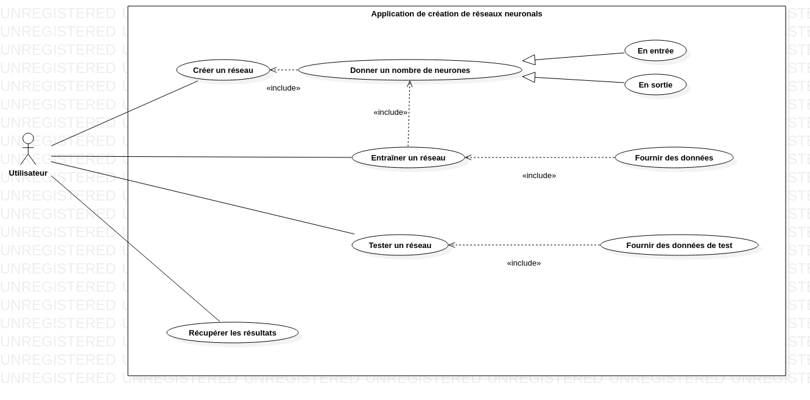
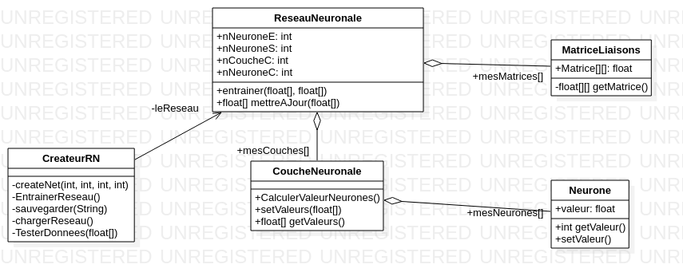
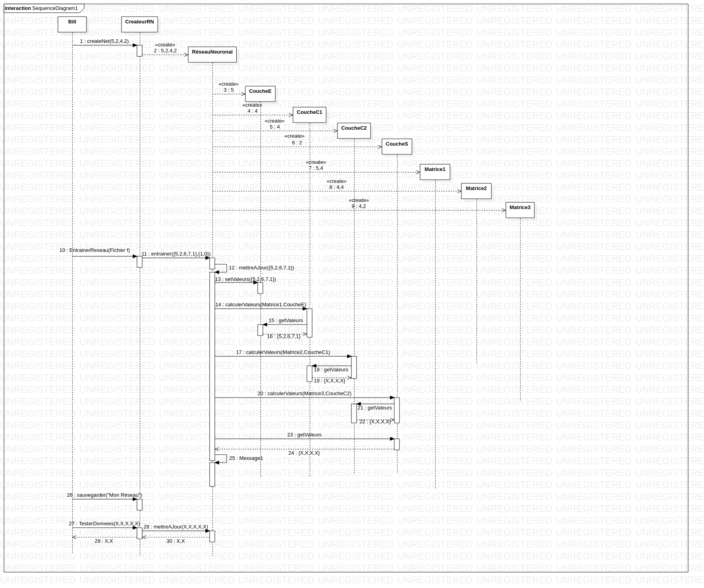

# Projet Tutoré 2019

__Sujet :__ Créateur de Réseaux de Neurones Artificiels

__But :__ 

Nous souhaitons développer une application permettant de créer des **réseaux de neurones artificiels**. Cette application aura une **interface graphique** dans laquelle l'utilisateur pourra renseigner :
* le nombre de neurones d'entrées
* le nombre de neurones de sorties
* le nombres de couches de neurones cachées, et le nombre de neurones par couche cachée.

Ces informations permettront de créer un réseau neuronal sur mesure. Puis l'utilisateur pourra renseigner un fichier suivant un format décrit dans l'application pour servir d'**entrainement au réseau**.
Enfin une fois le réseau entrainé il pourra alors lui renseigner les **valeurs qu'il souhaite tester** via un nouveau fichier suivant un format, et le réseau renverra les valeurs de réponses dans un fichier qui se sauvegardera dans un dossier choisit par l'utilisateur OU à l’écran, si le résultat n’est pas trop grand.
Plus tard nous pourrons ajouter la possibilité de transformer un **stock d'images** en **fichier utilisable par l'application**, la possibilité de **sauvegarder les réseaux**, de les **charger**, et de pouvoir les utiliser dans d'autres applications etc..

__Notre groupe :__
**Sylvain Thor** (groupe 3), **Hugo Sinprasith** (groupe 4), **Louis Chaillou** (groupe 2) et **Lucca Anthoine** (groupe 2)

__Chef de groupe :__
Lucca Anthoine

__Tuteur :__
M. Loukianov

## Analyse Fonctionnelle :
Notre application 
### Synopsis :
Sylvain aimerait faire un **réseau neuronal**. Il va sur l’application avec le désir de faire un réseau de 5 neurones d’entrée, 2 couches cachées, et 2 neurones de sortie.
Il rentre ces chiffres dans l’application et valide la création du réseau.
Il sélectionne ensuite le fichier « example.txt » afin de permettre à l’application d’entraîner le réseau.
Un fois le réseau entraîné, sylvain le sauvegarde sous le nom de « MonReseau ». Enfin il rentre des données à faire vérifier par le réseau et les récupère.

### Diagramme de Cas d'Usage :

### Diagramme de classe :
Pour le moment voilà le DDC que nous suivrons :

### Diagramme de Séquence :
Voici le diagramme (en partie résumé) de Séquence correspondant au Synopsis

## Analyse Technique

Nous utiliserons le language **python** que nous apprendrons tout au long de notre projet.
Nous suivrons la méthode **SCRUM** en avançant progressivement, en faisant des petites réunions de mise au point chaque jeudi de 13h45 à 14h.
Nous ferons du **Test Driven**, _(l'écriture de test avant la création des fonctionnalités)_ 
et du **pair-programming** dont les groupes changeront tous les mois.

Les fonctionnalités de l'application seront les suivante :

_la priorité est établie par la notation MoSCoW càd Must Should Could Would, Must étant pour les fonctionnalités les plus prioritaires et Would les fonctionnalités les plus facultatives_

| Fonctionnalités                                 | MoSCoW | Fait ? |
| :--------------------                           | ------ | -----: |
| Creation non graphique d'un Reseau              | M | OUI |
| Lancement d'un test                             | M | OUI |
| Recuperation du Resultat                        | M | OUI |
| Ajout de la fonction d'activation d'un Neurone  | M | OUI |
| Retropropagation de l'erreur                    | M | OUI |
| Lancement d'un entrainement complet             | S | OUI |
| Lancement d'un entrainement avec un fichier     | S | OUI |
| Utiliser un Reseau Entrainé                     | S | NON |
| Sauvegarder un Reseau                           | C | OUI |
| Charger un Reseau                               | C | OUI |
| Transformer une image en données d'entrainement | W | NON |
| Ajouter une interface graphique                 | S | OUI |
